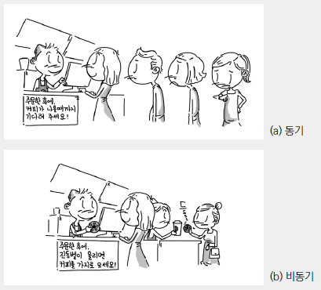

# 자바스크립트 - Day 4

날짜: 2025년 7월 31일

# 📘 자바스크립트 비동기

---

## 🧠 자바스크립트 싱글 스레드(Single Thread) 언어이다❗️

### **📌 스레드(Thread)란?**

- 스레드는 프로그램이 작업을 수행하는 실행 단위
- 멀티 스레드를 사용하면 동시에 여러 작업을 처리
- **싱글 스레드는 한 번에 오직 하나의 작업만 처리**
    
    <aside>
    ⚠️
    
    ### 싱글 스레드의 한계
    
    - 긴 작업(예: 서버 요청, 대용량 연산)을 메인 스레드에서 처리하면 **브라우저가 멈춘 것처럼 보일 수 있음**.
    - 사용자 입력, 애니메이션 등이 **블로킹(blocking)** 될 수 있음.
    
    - 자바스크립트는 어떻게 이를 보완할까❓
        
        정답 : 비동기처리
        
    </aside>
    

## ❤️‍🩹 동기 & 비동기

<aside>
💡

- 예제 이미지
    
    
    
</aside>

- 동기는 말 그대로 동시에 일어난다는 뜻. 요청과 그 결과가 동시에 일어남.
- 비동기는 동시에 일어나지 않는다를 의미. 요청과 결과가 동시에 일어나지 않음.

### 🛠  예시

- 동기 (순서대로 실행)

💥 모든 작업이 **기다리면서 순서대로** 실행됨 → **느려요!**

```html
<button onclick="makeCoffee()">커피 만들기 시작</button>
<button onclick="nextOrder()">다음 손님 주문</button>

<script>
  function blockFor5Seconds() {
    const end = Date.now() + 5000;
    while (Date.now() < end) {}
  }

  function makeCoffee() {
    console.log("1. 커피 주문");
    console.log("2. 커피 만드는 중");

    blockFor5Seconds(); // UI 멈춤

    console.log("3. 커피 다 됐어요! (진동벨 없음)");
    console.log("결제 💳 먼저 하고 싶어도 안 됨!");
  }
  function nextOrder() {
	  alert('다음 주문을 받아주세요!')
	  makeCoffee()
  }
</script>

```

- 비동기 (`setTimeout`으로 흉내내기)
💥 커피 만드는 동안 결제 **가능!** = 코드가 계속 실행됨 ✅

```html

<button onclick="makeCoffee()">커피 만들기 시작</button>
<button onclick="nextOrder()">다음 손님 주문</button>

<script>
  function makeCoffee() {
    console.log("1. 커피 주문");
    console.log("2. 커피 만드는 중");

    setTimeout(() => {
      console.log("3. 커피 다 됐어요! (진동벨 울림)");
    }, 5000);

    console.log("결제 💳 먼저!!!");
  }
  function nextOrder() {
	  alert('다음 주문을 받아주세요!')
	  makeCoffee()
  }
</script>

```

## ☕️ 커피는 순서대로 만들어야 합니다!

> **앞 작업이 끝나야 다음 작업을 제대로 할 수 있는 "의존성"이 있기 때문.**
> 

커피 만드는 순서를 동시에 실행하면!

```jsx
// 각각의 함수를 실행하면, 순서를 보장할 수 없음.
grindBeans();
boilWater();
brewCoffee(); // 원두를 갈아야 함. 물이 끓어야 함.
pourIntoCup(); // 원두를 갈아야 커피를 만들고...
serveToCustomer(); // 그러니까 원두를 갈아야...휴
```

- 컵에 물도 없이 커피를 붓는 상황 발생
- 원두도 안 갈았는데 추출부터 시도 → ❌
- 손님한테 뜨거운 물만 주는 참사 발생 😨

**✅ 실무작업 시 순차 작업이 필요한 경우는?**

```jsx
loginUser()
getUserInfo()
updateUserInfo()

✅ 1. 로그인 완료 (토큰 발급)
✅ 2. 토큰(token-abc123)으로 유저 정보 가져옴
✅ 3. 유저 정보 수정
```

🔄 반대로, **순차가 필요 없는 경우**는?

- 서로 **독립적인 작업**일 때 병렬로 가능!

```jsx
fetchNews();
fetchWeather();
fetchStock();

📰 뉴스 불러옴
🌤️ 날씨 정보 불러옴
📈 주식 시세 불러옴
✅ 모두 로딩 완료!
```

## 😭😭 그래서 비동기 작업을 순차적으로 실행하려면 어떻게 해야하는데!

> 자바스크립트에서 비동기 작업을 순차적으로 실행하려면
반드시 **`callback`, `promise`, `async`/`await` 중 하나를 사용**해야 한다.
> 

<aside>
👉

그런데 `promise`와 `async/await`가 없었을 때는 방법이 `callback` 밖에 없었다.

그리하여 콜백 지옥이 생기게 되었다는 슬픈 이야기… 또로록…

</aside>

### 🤬 1단계: Callback (콜백 함수)

**❌ a.k.a. 콜백 지옥 (Callback Hell)**

```jsx

// 멸망의 피라미드
function orderCoffee(callback) {
  setTimeout(() => {
    console.log("1. 커피 주문 받음");
    grindBeans(() => {
      boilWater(() => {
        brewCoffee(() => {
          serve(() => {
            console.log("☕ 커피 제공 완료!");
            callback && callback();
          });
        });
      });
    });
  }, 1000);
}

function grindBeans(callback) {
  setTimeout(() => {
    console.log("2. 원두 갈기 완료");
    callback && callback();
  }, 1000);
}

function boilWater(callback) {
  setTimeout(() => {
    console.log("3. 물 끓이기 완료");
    callback && callback();
  }, 1000);
}

function brewCoffee(callback) {
  setTimeout(() => {
    console.log("4. 커피 내리기 완료");
    callback && callback();
  }, 1000);
}

function serve(callback) {
  setTimeout(() => {
    console.log("5. 손님에게 커피 제공");
    callback && callback();
  }, 1000);
}

orderCoffee();

```

### 🤮 2단계: 콜백을 개선하기 위한 코드 구조화(코드 파편화! 너무 복잡해! 우웩~!)

```jsx
function delayTask(task, callback) {
  setTimeout(() => {
    console.log(task);
    callback && callback();
  }, 1000);
}

// 단계들을 배열로 정의
const steps = [
  (next) => delayTask("1. 커피 주문 받기", next),
  (next) => delayTask("2. 원두 갈기", next),
  (next) => delayTask("3. 물 끓이기", next),
  (next) => delayTask("4. 커피 내리기", next),
  (next) => delayTask("5. 손님에게 커피 제공", next),
  () => console.log("☕ 커피 제공 완료!")
];

// 단계 실행 함수
function runSteps(steps) {
  function nextStep(index) {
    const step = steps[index];
    if (!step) return;
    step(() => nextStep(index + 1)); // 다음 단계로 이동
  }

  nextStep(0); // 첫 번째 단계부터 시작
}

// 실행
runSteps(steps);

```

### 💌 3단계: 위의 고통을 해소한 Promise (약속 객체)

```jsx
function delayTask(task, fail = false) {
  return new Promise((resolve, reject) => {
    setTimeout(() => {
      if (fail) {
        reject(`${task} 실패!`);
      } else {
        console.log(`${task} 완료`);
        resolve();
      }
    }, 1000);
  });
}

delayTask("1. 커피 주문 받기")
  .then(() => {
    return delayTask("2. 원두 갈기");
  })
  .then(() => {
    return delayTask("3. 물 끓이기");
  })
  .then(() => {
    return delayTask("4. 커피 내리기");
  })
  .then(() => {
    return delayTask("5. 손님에게 커피 제공");
  })
  .then(() => {
    console.log("☕ 커피 제공 완료!");
  })
  .catch((err) => {
    console.error("🚨 어딘가에서 에러 발생:", err);
  });

```

❌ 단점

- `then`이 많아지면 결국 **중첩 느낌** 발생
- `catch`는 **어느 단계에서 에러가 났는지 명확히 구분하기 힘듦**

### 🌈 4단계: async/await

```jsx
function delayTask(task, fail = false) {
  return new Promise((resolve, reject) => {
    setTimeout(() => {
      if (fail) {
        reject(`${task} 실패!`);
      } else {
        console.log(`${task} 완료`);
        resolve();
      }
    }, 1000);
  });
}

async function makeCoffee() {
  
  await delayTask("1. 커피 주문 받기");
  
  try {
    await delayTask("2. 원두 갈기", true); // 일부러 실패 시킴
  } catch (err) {
    console.warn("⚠️ 원두 갈기 문제 발생:", err);
    // 원두 실패해도 계속 진행할 수 있게 처리
  }

  await delayTask("3. 물 끓이기");
  await delayTask("4. 커피 내리기");
  await delayTask("5. 손님에게 커피 제공");

  console.log("☕ 커피 제공 완료!");
  
}
```

💯 장점

- **완전한 동기 코드처럼 읽힘**
- 순서 파악 쉬움
- `try/catch`로 에러 처리 가능

## ⁉️ async/await 를 쓸 때 Promise가 계속 쓰이는 이유

- async/await는 Promise를 **더 읽기 쉽게** 만들어주는 문법 : ES2017 도입
- `await`는 항상 Promise를 기다림
- Promise 가 없으면 ***자동 래핑(auto-wrapping)*** 함

```jsx
await 123;

// 내부적으로 이렇게 바꿈: ***auto-wrapping***
await Promise.resolve(123);
```

```jsx
async function test() {
  const result = await someFunction;
  
  // 내부적으로 이렇게 바꿈: ***auto-wrapping***
  const result = await Promise.resolve(someFunction);

  console.log(result);
}
```

## **🧠 자바스크립트의 대표적인 비동기 함수**

| 종류 | 함수 | 설명 |
| --- | --- | --- |
| 📅 타이머 | `setTimeout(fn, ms)` | 일정 시간 후 `fn` 실행 |
| 📅 타이머 | `setInterval(fn, ms)` | 일정 간격마다 `fn` 반복 실행 |
| 📡 네트워크 | `fetch(url)` | 서버로부터 데이터 가져오기 (Promise 반환) |
| 🧾 AJAX | `XMLHttpRequest` | 오래된 방식. fetch 등장 전 사용 |
| 📁 파일 | `FileReader.readAsText()` | 파일을 읽고 콜백으로 결과 전달 |
| 🧰 이벤트 | `addEventListener` | 클릭, 입력, 로딩 등 비동기적으로 이벤트 발생 시 실행 |
| 🧲 애니메이션 | `requestAnimationFrame` | 다음 프레임에 실행할 작업 예약 |
| 🧪 비동기 함수 | `async function` | 내부에서 await 사용 가능. Promise 반환 |

### 📌 요약

<aside>
💡

`setTimeout`, `fetch`, `XMLHttpRequest`, `FileReader` 등 자바스크립트 **비동기 함수는** **작업 완료 시점**을 보장할 수 없음!

그래서 **"끝난 후에 실행할 작업"을 미리 등록해두어야 함**

</aside>

### ⭐️ `setTimeout()` 자체는 Promise를 반환하지 않아요!

```jsx
function wait(ms) {
  return new Promise((resolve) => {
    setTimeout(() => {
      resolve(`⏱ ${ms}ms 지남`);
    }, ms);
  });
}

wait(2000).then((result) => {
  console.log(result); // ⏱ 2000ms 지남
});

// or

async function run() {
  console.log("기다리는 중...");
  const msg = await wait(1500);
  console.log(msg); // ⏱ 1500ms 지남
  console.log("끝!");
}

run();
```

### ⭐️ async 함수는 자동으로 Promise 반환

```jsx
async function hello() {
  return "안녕!";
}

hello().then(console.log); // 👉 "안녕!"
```

```jsx
function fetchWithAuth(token) {
  if (!token) return Promise.reject("❌ 인증 토큰이 없습니다.");

  return fetch("/api/protected", {
    headers: { Authorization: `Bearer ${token}` },
  }).then(res => res.json());
}

```

### ⭐️ fetch도 자동으로 Promise 반환

<aside>
📌

`fetch`란?

> `fetch`는 자바스크립트에서 웹 서버에 HTTP 요청을 보내는 함수야.
> 
</aside>

```jsx
fetch('https://jsonplaceholder.typicode.com/todos/1')
        .then(response => response.json())
        .then(data => console.log(data))
        .catch(error => console.error('에러 발생:', error))
        .finally(() => console.log('요청 완료'));
```

 

✅ 특징

- 내장 함수 (브라우저에 기본 내장됨)
- Promise를 반환함 → `.then()`, `await`로 결과 처리 가능
- JSON, 텍스트, 파일 등 다양한 데이터 요청 가능
- Ajax의 최신 대체제

```jsx
<ul id="user-list"></ul>

  <script>
    async function renderUsers() {
      const res = await fetch('https://jsonplaceholder.typicode.com/users');
      const users = await res.json();

      const list = document.getElementById('user-list');
      users.forEach(user => {
        const li = document.createElement('li');
        li.textContent = `${user.name} (${user.email})`;
        list.appendChild(li);
      });
    }

    renderUsers();
  </script>
```

## 🎮 실습 코드 예시

### 📌 커피주문받기

```jsx
	<h2>☕ 커피 주문 시스템 (async/await)</h2>
  <button onclick="handleOrder()">📦 커피 주문하기</button>
  <div id="log"></div>

  <script>
    let orderNumber = 0;

    // 커피 만드는 함수 (Promise + async/await)
    function makeCoffee(orderId) {
      return new Promise((resolve) => {
        setTimeout(() => {
          resolve(`[${orderId}번째 주문] ✅ 커피 완성! 진동벨 울림!`);
        }, 3000);
      });
    }

    // 주문 처리 함수
    async function handleOrder() {
      orderNumber++;
      const currentOrder = orderNumber;

      const log = document.getElementById("log");

      // DOM에 주문 추가
      const logItem = document.createElement("div");
      logItem.className = "log-item";
      logItem.id = `order-${currentOrder}`;
      logItem.textContent = `[${currentOrder}번째 주문] 커피를 만드는 중입니다...`;
      log.appendChild(logItem);

      // 커피 만들기 (비동기 기다리기)
      const result = await makeCoffee(currentOrder);

      // 커피 완성 메시지로 업데이트
      logItem.textContent = result;
    }
  </script>
```